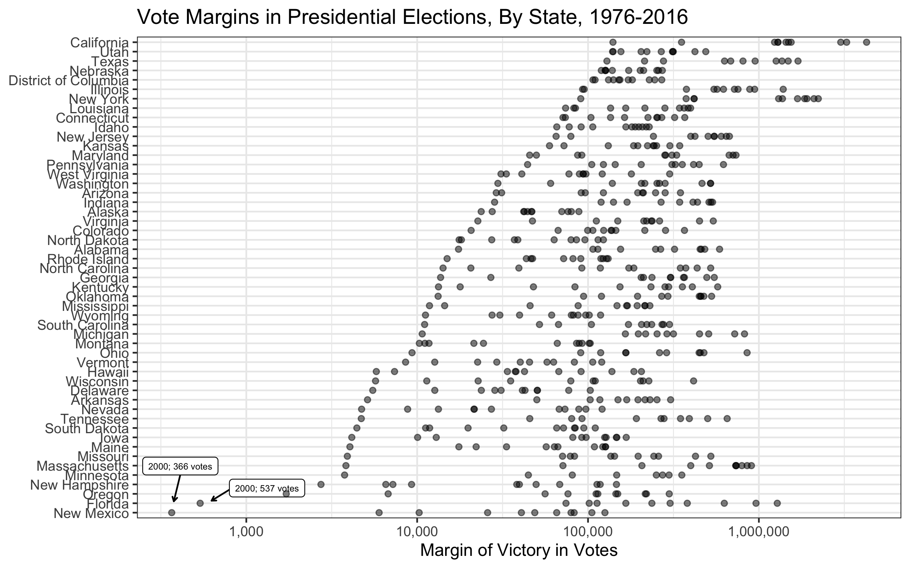

How Close Is Close?
================

## Data

Data come from the [MIT Election Lab](https://electionlab.mit.edu/data).
You can find the raw data on
[Dataverse](https://dataverse.harvard.edu/dataset.xhtml?persistentId=doi:10.7910/DVN/42MVDX).

The script `R/clean-data.R` wrangles the raw data into
`data/votes-margin.rds` and \``data/votes-margin.rds`, which are just
different file types for the clean data.

## Plot

Here’s the plot made by `R/make-plot.R`.



## Table

The table below shows the 10 closest contests.

``` r
library(tidyverse)
library(kableExtra)
read_rds("data/votes-margin.rds") %>%
  top_n(-10, votes_margin) %>%
  arrange(votes_margin) %>%
  select(State = state,
         Year = year, 
         `Margin of Victory in Votes` = votes_margin) %>%
  kable(format = "markdown")
```

| State         | Year | Margin of Victory in Votes |
| :------------ | ---: | -------------------------: |
| New Mexico    | 2000 |                        366 |
| Florida       | 2000 |                        537 |
| Oregon        | 1976 |                       1713 |
| New Hampshire | 2016 |                       2736 |
| Minnesota     | 1984 |                       3761 |
| Massachusetts | 1980 |                       3829 |
| Missouri      | 2008 |                       3903 |
| Maine         | 1976 |                       4041 |
| Iowa          | 2000 |                       4144 |
| South Dakota  | 1976 |                       4437 |
